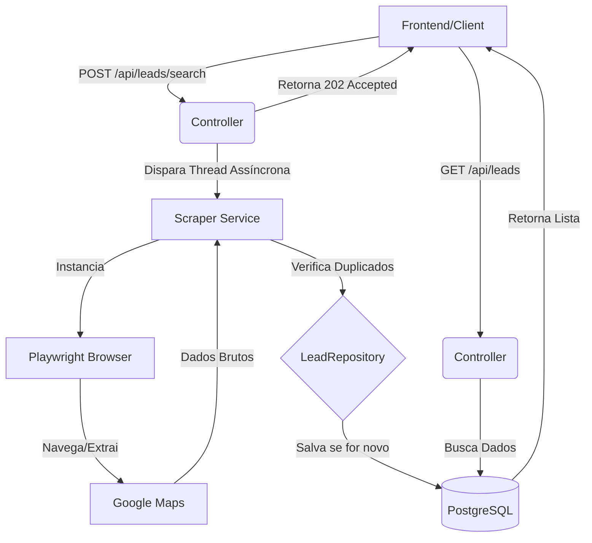

# 🚀 LeadFlow - Automação de Leads B2B

O **LeadFlow** é uma solução robusta de inteligência comercial desenvolvida para resolver um problema crítico em empresas B2B: o tempo gasto na busca manual por potenciais clientes. 

Esta API automatiza a extração de dados públicos do Google Maps (Nome, Telefone, Site, Endereço), processa as informações em segundo plano e organiza tudo em um banco de dados pronto para o seu time de vendas.

## 💡 Problema vs Solução

- **O Problema:** Vendedores perdem cerca de 30% da semana buscando contatos manualmente no Google, copiando e colando telefones em planilhas.
- **A Solução:** O LeadFlow permite disparar uma busca (ex: "Oficinas em São Paulo"), e enquanto o robô trabalha em background, o vendedor foca em fechar negócios.

<p align="center">
  
</p>

## 🛠️ Stack Tecnológica

- **Java 17 & Spring Boot 3**: Núcleo da aplicação de alta performance.
- **Playwright for Java**: Automação de navegador de última geração (mais rápido e seguro que Selenium).
- **PostgreSQL**: Persistência de dados robusta e confiável.
- **Spring Data JPA**: Abstração de banco de dados e manipulação de entidades.
- **Spring Doc / Swagger**: Documentação interativa da API.

## ⚙️ Diferenciais Técnicos (XP de Mundo Real)

- **Processamento Assíncrono (`@Async`)**: A API recebe a requisição e libera o cliente imediatamente com um status `202 Accepted`. O robô continua trabalhando em uma thread separada, evitando timeouts de conexão.
- **Inteligência de Dados**: Sistema de verificação de duplicidade que impede a inserção de leads repetidos na mesma categoria.
- **Simulação de Comportamento Humano**: Configuração de User-Agents e delays estratégicos para evitar bloqueios por parte dos provedores de dados.
- **Documentação Automática**: API totalmente documentada via Swagger, facilitando a integração com qualquer frontend.

## 📐 Arquitetura do Sistema



## 🚀 Como Executar o Projeto

1. Pré-requisitos:
  - Java 17 ou superior
  - PostgreSQL rodando localmente
  - Maven

2. Configuração do Banco:
  - Crie um banco de dados chamado lead_db no seu PostgreSQL.

3. Instalação do Scraper:
  - No terminal do projeto, instale os navegadores necessários para o Playwright:
```Bash
mvn exec:java -e -D exec.mainClass=com.microsoft.playwright.CLI -D exec.args="install"
```

4. Rodar Aplicação:
```Bash
mvn spring-boot:run
```

5. Acessar Documentação:
Abra http://localhost:8080/swagger-ui/index.html para testar os endpoints.


## 📝 Endpoints Principais

| Método | Endpoint | Descrição |
|--------|----------|-----------|
| `POST` | `/api/leads/search?query={termo}` | Inicia o processo de coleta de leads com base no termo informado. |
| `GET` | `/api/leads` | Retorna todos os leads armazenados no banco de dados. |
| `DELETE` | `/api/leads/{id}` | Remove um lead específico pelo seu identificador. |
